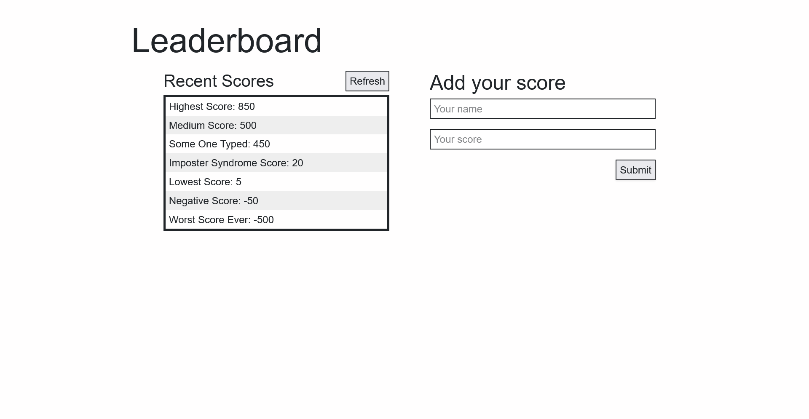

[](https://app.netlify.com/sites/leaderboard-v1/deploys) 


# LeaderBoard-v1 Project
The leaderboard website displays scores submitted by different players. It also allows you to submit your score. All data is preserved thanks to the external Leaderboard API service. This was an educational project with the Microverse bootcamp.

# Screen Shots


## Built With &hearts;
- HTML
- CSS
- JavaScript
- Webpack
- VScode
- Git & GitHub
## Live Demo

[Live Demo Link](https://leaderboard-v1.netlify.app/)

### Prerequisites
have a working git on your localmachine.
## Install
To get a working local copy up and running follow these simple steps
- open terminal
- clone this project with the command:


```
$ git clone https://github.com/mrEckendonk/leaderboard-v1.git
```
- Finally, run the next command in the terminal to install dependencies:

```
$ npm i
```	
- To run the app in the browser, run the following command:

```
$ npm run start
```
### Usage
For anyone that whats to learn html & css & Js
### Run tests
N/A
### Deployment
N/A


## Author

👤 **Author**

- GitHub: [@mrEckendonk](https://github.com/mrEckendonk)
- Twitter: [@twitter](https://twitter.com/mike_eckendonk)
- LinkedIn: [LinkedIn](https://www.linkedin.com/in/mike-van-eckendonk)

## 🤝 Contributing

Contributions, issues, and feature requests are welcome!

Feel free to check the [issues page](https://github.com/mrEckendonk/leaderboard-v1/issues).

## Show your support

Give a ⭐️ if you like this project!

## Acknowledgments

- Hat tip to anyone whose code was used
- Inspiration 💘
- Microverse program ⚡
- My standup team 🏹
- My family's support 🙌

## 📝 License

This project is [MIT](./MIT.md) licensed.